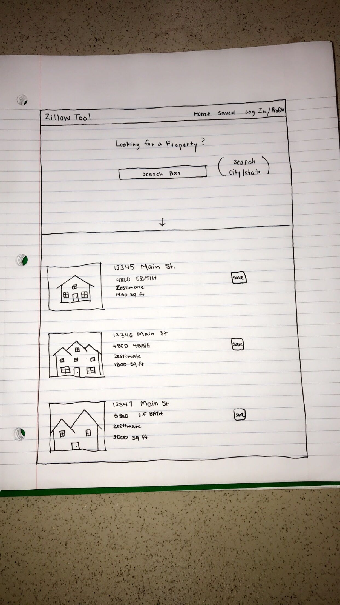

# Project 3 

# Zillow Tool

## What does it do

### Retrieves sale price from each state

### Fetches monthly sale price in given State & City 

### User Log In using mongoDB 

### Google Auth w/ saved specific deep search results 

### Displays specific properties info and Photo

## Technologies Used 

### MongoDB

### GoogleAuth

### ZillowAPI

### React 5

## WireFrame

