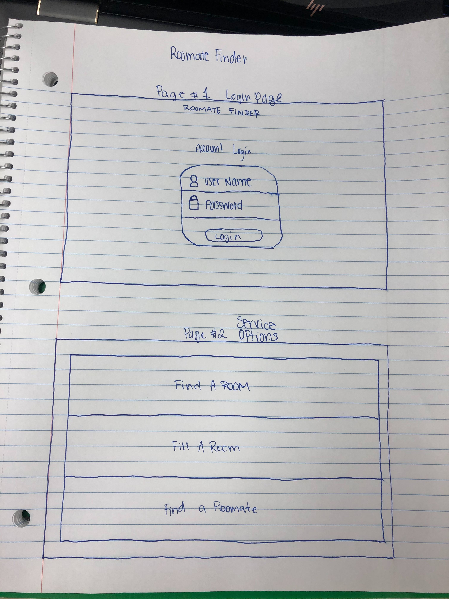
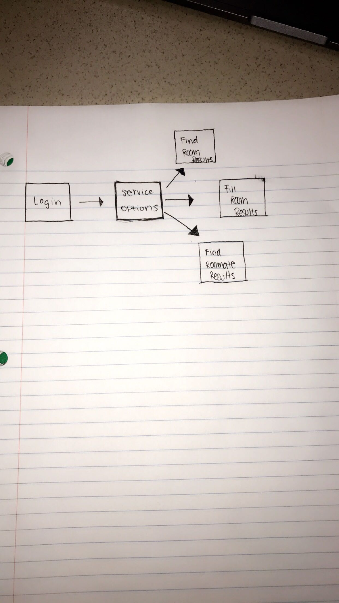

# Project 3 

# Roommate Finder

## What does it do
Our app Roommate Finder offers a unique way to find a roommate. A user can create a profile that will have a description of what they're looking for. Other users will be able to view other profiles and filter out what theyre looking for by.Our application will consist of two API's. Google auth to sign in and filestack to upload a profile picture. We want to create a database based on the information the user gives us to later retrive it for other users such as an email. If everything goes well, we want to add aditional search filters.

### User Log In using mongoDB 

### Google Auth w/ saved specific deep search results 

### Displays profiles

## Technologies Used 

### MongoDB

### Passport JS

### GoogleAuth

### Filestack

### React 5

## WireFrame

